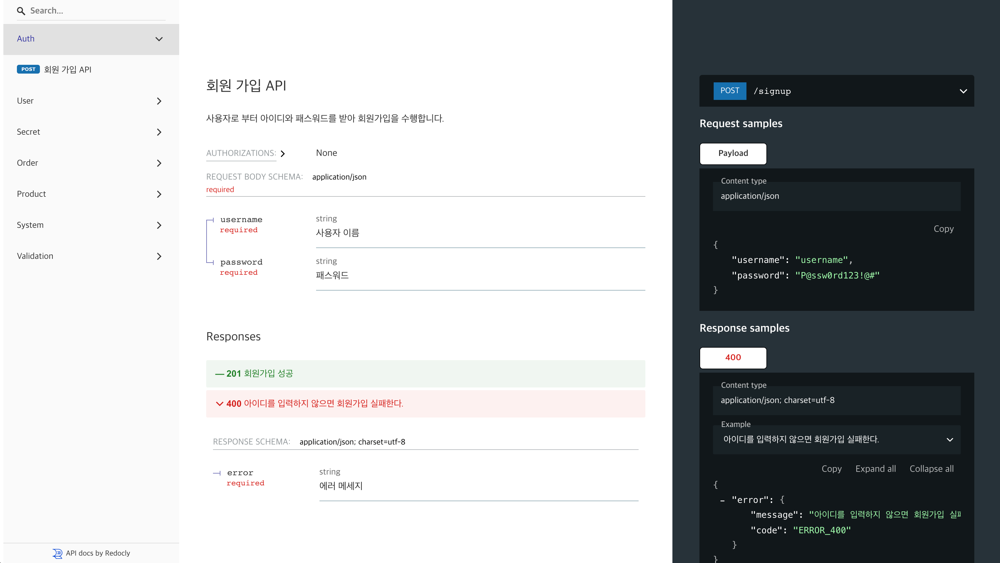

> 저뿐만 아니라, 두 분의 열정적인 팀원 덕분에 수월하게 배포할 수 있었습니다.<br/>
> 국내 CS 분야 1등 서적을 집필하신 홍철님, 그리고 수많은 아웃소싱 프로젝트를 성공적으로 이끌어오신 재송님.<br/>
> 현생에 바쁘실텐데도 하나의 목표를 위해 함께 해주셔서 정말 감사드립니다. (꾸벅)

---

이번 달 초, 저희는 [itdoc]을 정식 배포했습니다.

<!--truncate-->

`itdoc`은 테스트 코드를 기반으로 **신뢰성 있는 API 문서**를 자동으로 생성하는 도구입니다.

## 왜 `itdoc`을 만들게 되었나요?

`JavaScript` 진영에서는 API 문서를 작성하는 방법이 다양합니다. 하지만 기존 방법들은 여러 문제를 안고 있었습니다.

### JS 진영의 API 문서 작성 방법

#### 1. [Postman]을 이용해 수동으로 작성하는 방법

서버 API 개발자라면 한 번쯤은 [Postman]을 사용해보셨을 것입니다.

Postman을 쓰면서 느꼈던 점은, **정말 간편하고 직관적**이라는 것이었습니다.
하지만 코드를 작성하면서 매번 Alt+Tab으로 창을 전환하고, 테스트 결과를 별도로 문서화하는 과정은 정말 번거로웠습니다.

[postman]: https://www.postman.com/

#### 2. [Swagger]를 이용해 자동으로 생성하는 방법

[Swagger]: https://swagger.io/

Swagger도 서버 개발자라면 익숙하실 텐데요. Swagger를 사용할 때는 보통 두 가지 방식이 있습니다:

- **2.1. 주석을 통해 API 문서를 작성하는 방법**

    일반적으로 다음과 같이 주석으로 작성합니다:

    ```js
    /**
     * @swagger
     * /api/v1/users/login:
     *   post:
     *     summary: 사용자 로그인
     *     description: 아이디와 패스워드를 사용하여 로그인합니다.
     *     tags:
     *       - Users
     *     requestBody:
     *       required: true
     *       description: 로그인에 필요한 아이디와 비밀번호
     *       content:
     *         application/json:
     *           schema:
     *             type: object
     *             required:
     *               - username
     *               - password
     *             properties:
     *               username:
     *                 type: string
     *                 description: 아이디
     *                 example: admin
     *               password:
     *                 type: string
     *                 description: 사용자 비밀번호
     *                 example: admin
     *     responses:
     *       200:
     *         description: 로그인 성공 시 반환되는 응답
     *         content:
     *           application/json:
     *             schema:
     *               $ref: '#/components/schemas/SuccessResponse'
     *       400:
     *         description: 요청에 필요한 정보(username 또는 password)가 누락된 경우
     *         content:
     *           application/json:
     *             schema:
     *               $ref: '#/components/schemas/ErrorResponse'
     *       401:
     *         description: 로그인 실패 (잘못된 사용자 이름 또는 비밀번호)
     *         content:
     *           application/json:
     *             schema:
     *               $ref: '#/components/schemas/ErrorResponse'
    */
    routes.post("/users/login", async (req, res) => {
        const { username, password } = req.body
    // 코드 생략
    })
    ```

    하지만 주석 기반 작성은 **코드를 지저분하게 만들고**,
    API 스펙 변경 시 관련 주석을 수정하기 위해 마우스 스크롤을 계속해야 하는 단점이 있습니다. *(방금 여러분이 이 글을 읽기 위해 스크롤을 내린 것처럼요.)*

- **2.2. 별도의 `JSON` 파일로 작성하는 방법**

    코드와 문서를 분리할 수 있지만, API 구현이 바뀔 때마다 `JSON` 파일을 별도로 업데이트해야 합니다.
    실수로 업데이트를 누락하는 경우가 흔히 발생합니다.

게다가 Swagger는 [OpenAPI Specification]을 이해하고 작성해야 하므로, 초반 진입 장벽이 높은 편이며, 복잡해질 경우 **human-readable**하지 않습니다.

### 기존 도구들의 큰 문제점

요약하자면, 기존 방법은 모두 **별도의 추가 작업이 필요**합니다.
즉, API를 먼저 구현한 뒤, 별도로 문서화 작업을 해야 하죠. 매우 비효율적입니다.

그리고 협업 중에 이런 경험, 한 번쯤 있지 않으셨나요?

- 요청 파라미터에 오타가 있어 실제 동작과 문서가 다른 경우
- API 스펙이 변경되었지만 문서에는 반영되지 않은 경우
- 심지어 명세와 실제 API 동작이 일치하지 않는 경우

프론트엔드와의 협업, 또는 고객에게 API를 제공해야 한다면, **정확한 문서화**는 필수입니다. **저희는 이러한 문제를 해결하기 위해 `itdoc`을 만들게 되었습니다.**

## 그래서 `itdoc`은 무엇인가요?

`itdoc`은 테스트 코드를 기반으로 **신뢰성 있는 API 문서**를 자동으로 생성하는 도구입니다.

단순히 `itdoc`을 설치하고, 아래처럼 테스트 코드를 작성하고 테스트를 실행(`Jest` or `Mocha`)하기만 하면 됩니다.

```js
import { describeAPI, itDoc, field, HttpMethod, HttpStatus } from "itdoc"

const targetApp = app // 여러분이 작성한 Express 앱 인스턴스

describeAPI(
    HttpMethod.POST,
    "/signup",
    {
        name: "회원가입 API",
        tag: "Auth",
        summary: "신규 사용자를 시스템에 등록하기 위한 API입니다. 아이디와 패스워드를 입력받아 회원가입을 수행합니다.",
    },
    targetApp,
    (apiDoc) => {
        itDoc("회원가입 성공", () => {
            return apiDoc
                .test()
                .req()
                .body({
                    username: field("Username", "penekhun"),
                    password: field("Password", "P@ssw0rd123!@#"),
                })
                .res()
                .status(HttpStatus.CREATED)
        })

        itDoc("사용자 아이디가 주어지지 않으면 실패된다.", async () => {
            await apiDoc
                .test()
                .req()
                .body({
                    password: field("Password", "P@ssw0rd123!@#"),
                })
                .res()
                .status(HttpStatus.BAD_REQUEST)
                .body({
                    error: field("Error message", "username is required"),
                })
        })
    },
)
```

위 테스트를 실행하면, `itdoc`은 다음과 같은 [OpenAPI Specification]대로 문서의 `JSON`이 자동으로 생성됩니다.

```yaml
{
    "openapi": "3.0.0",
    "info": {
        "title": "API Documentation",
        "version": "1.0.0"
    },
    "servers": [
        {
            "url": "/",
            "description": "기본 서버"
        }
    ],
    "paths": {
        "/signup": {
            "post": {
                "summary": "회원가입 API",
                "tags": ["Auth"],
                "description": "신규 사용자를 시스템에 등록하기 위한 API입니다. 아이디와 패스워드를 입력받아 회원가입을 수행합니다.",
                "operationId": "postSignup",
                "requestBody": {
                    "content": {
                        "application/json": {
                            "schema": {
                                "type": "object",
                                "properties": {
                                    "username": {
                                        "type": "string",
                                        "example": "penekhun"
                                    },
                                    "password": {
                                        "type": "string",
                                        "example": "P@ssw0rd123!@#",
                                        "description": "패스워드"
                                    }
                                },
                            },
                            "example": {
                                "username": "penekhun",
                                "password": "P@ssw0rd123!@#"
                            }
                        }
                    },
                    "required": true
                },
                "security": [{}],
                "responses": {
                    "201": {
                        "description": "회원가입 성공"
                    },
                    "400": {
                        "description": "Bad Request",
                        "content": {
                            "application/json; charset=utf-8": {
                                "schema": {
                                    "type": "object",
                                    "properties": {
                                        "error": {
                                            "type": "string",
                                            "example": "사용자 아이디가 주어지지 않으면 실패된다.",
                                            "description": "에러 메세지"
                                        }
                                    },
                                    "required": ["error"]
                                },
                                "example": {
                                    "error": "username is required"
                                }
                            }
                        }
                    }
                }
            }
        },
    ...
}
```

더불어 해당 [OpenAPI Specification] 기반 [Redoc] 스타일의 깔끔한 html 문서도 **자동**으로 생성해줍니다



[Redoc]: https://github.com/Redocly/redoc

`itdoc`을 사용하는 팀의 입맛에 맞게 원하시는 `생성된 문서`를 사용하여 서빙하면 됩니다.

:::tip
`itdoc` 사용을 위한 거창한 코드/설정 작업은 필요 없습니다. (놀랍지 않나요..??)
:::

**더불어 테스트가 실패될 경우 문서 생성이 실패하므로, 항상 최신의 정확한 API 문서를 유지할 수 있습니다.**

### 어떤 사람이 쓰면 좋을까요?

- API 문서 작성이 귀찮은 분들 && API 통합테스트를 작성해오셨던 분들

- 실제 API 동작과 문서가 일치하지 않아 고생하신 분들

- 이제 막 node.js로 서버 애플리케이션 개발 프로젝트를 시작하신 분들

### 끝으로

아직은 초기 배포이기에 작은 해결 과제들이 많다고 생각합니다만, 지금 수준에도 도입을 고민해볼 정도로 좋은 프로젝트가 될 것이라 믿어 의심치 않습니다.

**이제는 `itdoc`을 통해 API 문서를 작성해보세요!**

더불어 사용하시는데에 문제가 있으시다면, 언제든지 [GitHub Issues]나 [Discord] 채널에 남겨주시면 감사하겠습니다.

[itdoc]: https://www.npmjs.com/package/itdoc
[Github Issues]: https://github.com/do-pa/itdoc/issues
[Discord]: https://discord.com/invite/ZhXk7VSu5Z

이 프로젝트를 사용해보고 싶다면, 아래 링크를 클릭하세요!

- [Github 레포지토리 확인](https://github.com/do-pa/itdoc)
- [빠른시작 가이드 확인](../docs/guides/quick-start)

[OpenAPI Specification]: https://swagger.io/specification/
